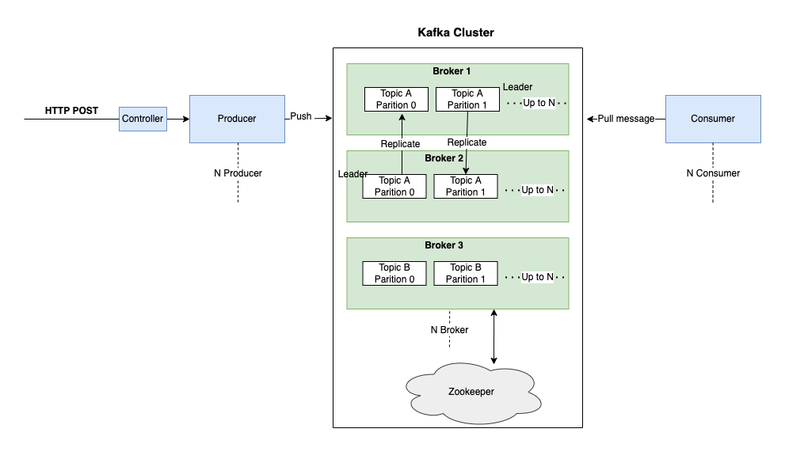
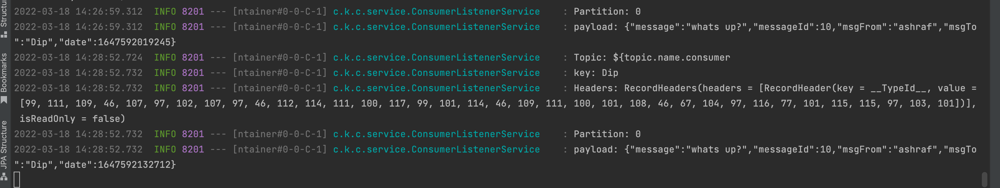

# kafka-Experiment

## Kafka Installation on MAC:

Ref: https://kafka.apache.org/quickstart

## Sample architecture diagram of Endpoint: [/producer/chat/chat] [/producer/generic/chat] :   

## Prerequisite Env
- Apache Maven: 3.8.4 (latest)
- Java version: 11
- Apache kafka: 3.1.0(latest)

## Run project : 
**Start the kafka environment first:** 

Start the ZooKeeper service: \
$ bin/zookeeper-server-start.sh config/zookeeper.properties

Start the Kafka broker service: \
$ bin/kafka-server-start.sh config/server.properties

**Run producer and consumer application:** 
- producer application runs on 8080 \
   $ cd producer/ \
   $ mvn spring-boot:run -DskipTests    

- consumer application runs on 8081 \
   $ cd producer/ \
   $ mvn spring-boot:run -DskipTests    

- Make a POST request to producer(8080) : \
   $ curl -X POST -H "Content-Type: application/json" \ \
   -d '{"message": "whats up?", "messageId": 10, "msgFrom":"ashraf", "msgTo":"Dip"}'  http://localhost:8080/producer/chat    

- Make a POST request to producer(8080) : \
    $ curl -X POST -H "Content-Type: application/json" \ \
    -d '{"message": "whats up?", "messageId": 10, "msgFrom":"ashraf", "msgTo":"Dip"}'  http://localhost:8080/producer/generic/chat    

- From consumer application console, we can see our consumer application consume that message from kafka topic \
   
## Producer application Endpoints:
| Method Type | Endpoint     | RequestBody                                                                         | Description                                    |
|-------------|--------------|-------------------------------------------------------------------------------------|------------------------------------------------|
| POST        | /producer/chat | {"message":"hi test ","messageId":10,"msgFrom":"ashraf","msgTo":"Dip"}              | Using ProducerService to send message to kafka |
| POST        | /producer/generic/chat | {"message":"hi test new generic new","messageId":10,"msgFrom":"ashraf","msgTo":"Dip"} | Using GenericProducerService  to send message to kafka                |

## Sample integration test on producer application
- Make sure Kafka environment(zookeeper, broker) is running 
- $ cd producer/
- $ mvn test

## Some command note on kafka

| Description                                                                                                                                                                                                                                                             | Command                                                                                                                                                                                                                               |
|-------------------------------------------------------------------------------------------------------------------------------------------------------------------------------------------------------------------------------------------------------------------------|---------------------------------------------------------------------------------------------------------------------------------------------------------------------------------------------------------------------------------------|
| **Start the ZooKeeper service :**                                                                                                                                                                                                                                       | $ bin/zookeeper-server-start.sh config/zookeeper.properties                                                                                                                                                                           |
| **Start the Kafka broker service :**                                                                                                                                                                                                                                    | $ bin/kafka-server-start.sh config/server.properties                                                                                                                                                                                  |
| **Create a topic :**                                                                                                                                                                                                                                                    | $ bin/kafka-topics.sh --create --topic topic-name-place-here --bootstrap-server localhost:9092                                                                                                                                        |
| **Describe a kafka topic :**                                                                                                                                                                                                                                            | $ bin/kafka-topics.sh --describe --topic topic-name-place-here --bootstrap-server localhost:9092                                                                                                                                      |
| **Write some events into topic :**                                                                                                                                                                                                                                      | $ bin/kafka-console-producer.sh --topic topic-name-place-here --bootstrap-server localhost:9092                                                                                                                                       |
| **Read the events consumer :**                                                                                                                                                                                                                                          | $ bin/kafka-console-consumer.sh --topic topic-name-place-here --from-beginning --bootstrap-server                                                                                                                                     
| **TERMINATE THE KAFKA ENVIRONMENT :**                                                                                                                                                                                                                                   | Stop the producer and consumer clients with Ctrl-C, if you haven't done so already.Stop the Kafka broker with Ctrl-C.Lastly, stop the ZooKeeper server with Ctrl-C.                                                                   
| **If you also want to delete any data of your local Kafka environment including any events you have created along the way, run the command:**                                                                                                                           | $ rm -rf /tmp/kafka-logs /tmp/zookeeper                                                                                                                                                                                               
| **Add kafka to your path to access from anywhere :**                                                                                                                                                                                                                    | $ nano ~/.bash_profile. Add Path, export PATH="$PATH:/Users/bdmbaa/Documents/work-space/runtime/kafka/kafka_2.13-3.1.0/bin". Then reload profile, $ source .bash_profile [to reload, now you can execute kafka command from anywhere] |
| **Create topic from terminal with partition and replication factor :**                                                                                                                                                                                                  | $ bin/kafka-topics.sh --bootstrap-server localhost:9092 --topic first_topic --create --partitions 3 --replication-factor 1                                                                                                            |
| **List all topics :**                                                                                                                                                                                                                                                   | $ bin/kafka-topics.sh --bootstrap-server localhost:9092 --list                                                                                                                                                                        |
| **Describe a topic :**                                                                                                                                                                                                                                                  | $ bin/kafka-topics.sh --bootstrap-server localhost:9092 --topic first_topic --describe                                                                                                                                                |
| **Delete a topic :**                                                                                                                                                                                                                                                    | $ bin/kafka-topics.sh --bootstrap-server localhost:9092 --topic second_topic --delete                                                                                                                                                 |
| **Produce some message :**                                                                                                                                                                                                                                              | $ bin/kafka-console-producer.sh --broker-list localhost:9092 --topic first_topic                                                                                                                                                      |
| **Produce some message with acts properties(producers) :**                                                                                                                                                                                                              | $ bin/kafka-console-producer.sh --broker-list localhost:9092 --topic first_topic --producer-property acks=all                                                                                                                         |
| **If a topic is not created but using in a producer to produce messages what happens then: first it will throw a warning as topic is not exist and leader not exist. Then producer client first create topic in background and self recover by electing leader as well.** | $ bin/kafka-console-producer.sh --broker-list localhost:9092 --topic new_topic                                                                                                                                                        |
| **Describe a topic :**                                                                                                                                                                                                                                                  | $ bin/kafka-topics.sh --bootstrap-server localhost:9092 --topic new_topic --describe                                                                                                                                                  |
| **We can change default server configuration like default partition size :**                                                                                                                                                                                            | $ nano config/server.properties then change the value of num.partitions                                                                                                                                                               |
| **Consumer order is only guaranteed in partition level :**                                                                                                                                                                                                              |                                                                                                                                                                                                                                       |
| if we want to see the all messages from the beginning - when consumer was down but producer produces messages then,                                                                                                                                                     | $ bin/kafka-console-consumer.sh --bootstrap-server localhost:9092 --topic first_topic --from-beginning                                                                                                                                |
| **Consumer group :** if multiple consumer within a same group consuming a topic then - every consumer will not get all messages, messages will disburse in round-robin partition wise. Each consumer will read from each partition.So that is the power of consumer groups. If one consumer goes down then load will be distributed along with the partition to others active consumers. As offsets have been committed in kafka , after reading a message by consumer it will never appear again. When consumer is down but producer continuing producing message - and when consumer gets back again then it will get only those messages(which it missed due to inactive) because of offset committing.| $ bin/kafka-console-consumer.sh --bootstrap-server localhost:9092 --topic first_topic --group my-first-application                                                                                                                    |
| **Show consumer group list :**| $ bin/kafka-consumer-groups.sh --bootstrap-server localhost:9092 --list                                                                                                                                                               |
| **Describe a consumer group :**| $ bin/kafka-consumer-groups.sh --bootstrap-server localhost:9092 --describe --group my-first-application . Lag 0 - means that, it has read all the data.                                                                              |
|  **Replay all messages by resetting offsets :**| To earliest: $ bin/kafka-consumer-groups.sh --bootstrap-server localhost:9092 --group my-first-application --reset-offsets --to-earliest --execute --topic first_topic                                                                |
| **Shift by forward or backward(-):**| $ bin/kafka-consumer-groups.sh --bootstrap-server localhost:9092 --group my-first-application --reset-offsets --shift-by 2 --execute --topic first_topic                                                                                                                                                                                                                                      |
|  **Kafka documentations along with the configurations :**|  https://kafka.apache.org/documentation/
