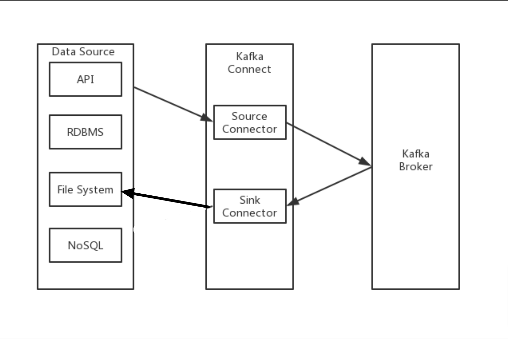
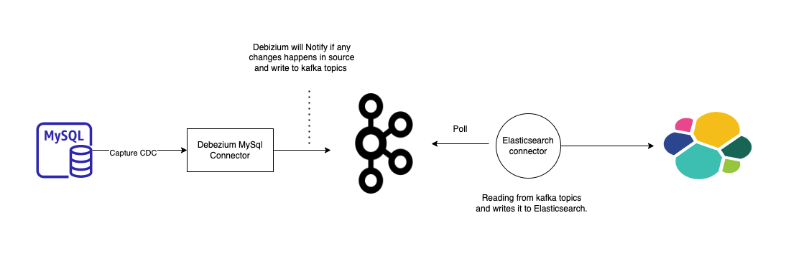
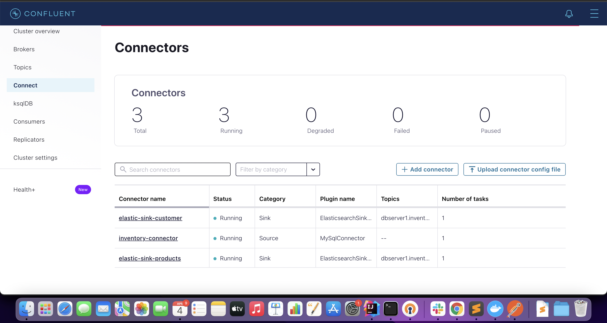
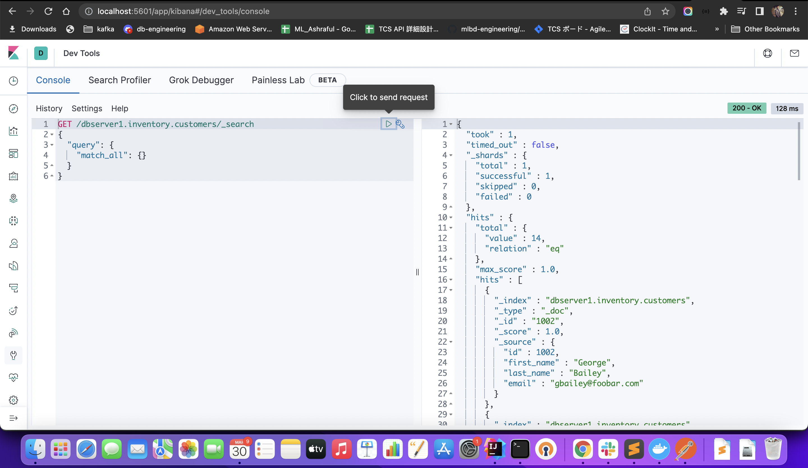
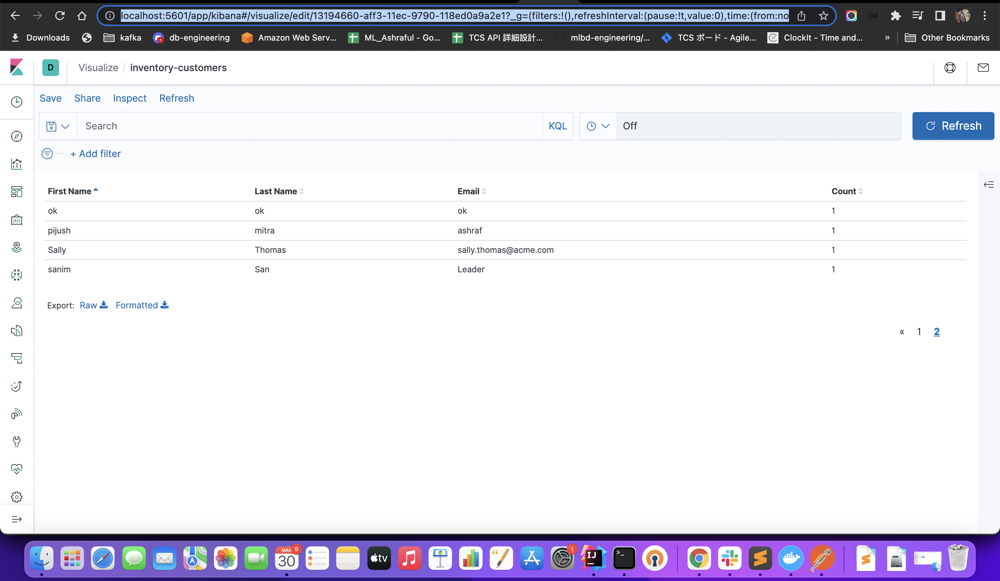

# kafka-Experiment

## Topic Experimented
- [Installation](#kafka-installation-on-mac)
- [Producer - Consumer](#sample-architecture-diagram-of-endpoint)
- [Producer - Consumer -avro- schema registry](#run-project-to-test-schema-registry)
- [Sample Integration Test On producer app](#sample-integration-test-on-producer-application)
- [Producer Endpoints](#producer-application-endpoints)
- [Kafka Connect](#kafka-connect)
- [FileStream Connectors example](#filestream-connectors-example)
- [MySQL to ElasticSearch using Debezium, Kafka, and Confluent ElasticSearch Sink Connector](#mysql-to-elasticsearch-using-debezium-kafka-and-confluent-elasticsearch-sink-connector)

## Kafka Installation on MAC

Ref: https://kafka.apache.org/quickstart

## Confluent Platform Installation
1. Download the confluent-7.0.2.tar.gz package from the [Confluent package archive](https://packages.confluent.io/archive/7.0/?_ga=2.264322063.1075689171.1649068749-1675562167.1646719441).
2. Use the tar command to decompress the archive file.

```$ tar -xvf confluent-7.0.2.tar.gz```
<br/>
The tar command creates the confluent-7.0.2 directory, which is the Confluent home directory. Run the ls command to examine its contents:

```$ls -al confluent-7.0.2```
<br/>
Your output should resemble:

```-rw-r--r--  1 jim jim  871 May 19 21:36 README
drwxr-xr-x  3 jim jim 4096 May 19 20:25 bin
drwxr-xr-x 17 jim jim 4096 May 19 20:25 etc
drwxr-xr-x  3 jim jim 4096 May 19 20:21 lib
drwxr-xr-x  3 jim jim 4096 May 19 20:25 libexec
drwxr-xr-x  7 jim jim 4096 May 19 20:25 share
drwxr-xr-x  2 jim jim 4096 May 19 21:36 src

```
3. Set the environment variable for the Confluent Platform home directory.
```$ export CONFLUENT_HOME=confluent-7.0.2```
4. Add the Confluent Platform bin directory to your PATH.
```export PATH=$PATH:$CONFLUENT_HOME/bin```
5. Test your installation by running the confluent command:
``confluent --help``
## Sample architecture diagram of Endpoint [/producer/chat/chat] [/producer/generic/chat] : <br/><br/>


## Prerequisite Env
- Apache Maven: 3.8.4 (latest)
- Java version: 11
- Apache kafka: 3.1.0(latest)
- Confluent Platform for schema registry and avro serializer and deserializer

## Run project normal producer-consumer: 
**Start the kafka environment first:** 

Start the ZooKeeper service: \
$ bin/zookeeper-server-start.sh config/zookeeper.properties

Start the Kafka broker service: \
$ bin/kafka-server-start.sh config/server.properties

**Run producer and consumer application:** 
- producer application runs on 8080 \
   $ cd producer/ \
   $ mvn spring-boot:run -DskipTests <br/> <br/>

- consumer application runs on 8082 \
   $ cd producer/ \
   $ mvn spring-boot:run -DskipTests <br/> <br/>

- Make a POST request to producer(8080) : \
   $ curl -X POST -H "Content-Type: application/json" \ \
   -d '{"message": "whats up?", "messageId": 10, "msgFrom":"ashraf", "msgTo":"Dip"}'  http://localhost:8080/producer/chat <br/> <br/>

- Make a POST request to producer(8080) : \
    $ curl -X POST -H "Content-Type: application/json" \ \
    -d '{"message": "whats up?", "messageId": 10, "msgFrom":"ashraf", "msgTo":"Dip"}'  http://localhost:8080/producer/generic/chat <br/> <br/>

- From consumer application console, we can see our consumer application consume that message from kafka topic \
   

## Run project to test schema registry(avro serializer and deserializer) 

**Using Manually:** <br/><br/>
Start the ZooKeeper service: \
$ bin/zookeeper-server-start.sh config/zookeeper.properties

Start the Kafka broker service: \
$ bin/kafka-server-start.sh config/server.properties

Start Schema Registry : \
$ cd confluent-7.0.1
$ bin/schema-registry-start ./etc/schema-registry/schema-registry.properties <br/>

**OR Using confluent platform** <br/><br/>

Run below command to up everything including zookeeper,kafka and schema registry :<br/>
$ confluent local services start <br/> <br/>

**Run producer and consumer application:**
- producer application(profile=avro) runs on 8080 and  \
  $ cd producer/ \
  $ mvn spring-boot:run -Dspring-boot.run.profiles=avro <br/> <br/>

- consumer application(profiles=avro) runs on 8082 \
  $ cd producer/ \
  $ mvn spring-boot:run -Dspring-boot.run.profiles=avro <br/> <br/>

- Make a POST request to check avro and schema registry: \
  $ curl -X POST -d 'name=vik&age=33' http://localhost:8080/person/test/avro
  <br/> <br/>

- From consumer application console, we can see our consumer application consume that message from kafka topic \
  

## Producer application Endpoints
| Method Type | Endpoint               | RequestBody                                                                           | Description                                               |
|-------------|------------------------|---------------------------------------------------------------------------------------|-----------------------------------------------------------|
| POST        | /producer/chat         | {"message":"hi test ","messageId":10,"msgFrom":"ashraf","msgTo":"Dip"}                | Using ProducerService to send message to kafka            |
| POST        | /producer/generic/chat | {"message":"hi test new generic new","messageId":10,"msgFrom":"ashraf","msgTo":"Dip"} | Using GenericProducerService  to send message to kafka    |
| POST        | /person/test/avro      | /person/test/avro?name=vik&age=33                                                     | Test Schema registry and avro serializer and deserializer |


## Sample integration test on producer application
- Make sure Kafka environment(zookeeper, broker) is running 
- $ cd producer/
- $ mvn test

## Kafka connect

Kafka Connect is a framework for connecting Kafka with external systems such as databases, key-value stores, search indexes, and file systems, using so-called Connectors.
Kafka Connectors are ready-to-use components, which can help us to import data from external systems into Kafka topics and export data from Kafka topics into external systems.

A source connector collects data from a system. Source systems can be entire databases, streams tables, or message brokers. A source connector could also collect metrics from application servers into Kafka topics, making the data available for stream processing with low latency.

A sink connector delivers data from Kafka topics into other systems, which might be indexes such as Elasticsearch, batch systems such as Hadoop, or any kind of database. <br/> <br/>

## FileStream Connectors example 
<br/><br/>


**Source Connector Configuration :** <br/>
For the source connector, the reference configuration is available at $CONFLUENT_HOME/etc/kafka/connect-file-source.properties:

name=local-file-source
connector.class=FileStreamSource
tasks.max=1
topic=connect-test
file=connect-data-test.txt


For this to work then, let's create a basic file with some content:
echo -e "Dip\nashraf\nmonstarlab\nkafka\ntesting\n" > $CONFLUENT_HOME/connect-data-test.txt


**Sink Connector Configuration :**

For our sink connector, we'll use the reference configuration at $CONFLUENT_HOME/etc/kafka/connect-file-sink.properties:

name=local-file-sink
connector.class=FileStreamSink
tasks.max=1
file=connecttest.sink.txt
topics=connect-test


**Worker Config :**

Finally, we have to configure the Connect worker, which will integrate our two connectors and do the work of reading from the source connector and writing to the sink connector.

For that, we can use $CONFLUENT_HOME/etc/kafka/connect-standalone.properties:

bootstrap.servers=localhost:9092
key.converter=org.apache.kafka.connect.json.JsonConverter
value.converter=org.apache.kafka.connect.json.JsonConverter
key.converter.schemas.enable=false
value.converter.schemas.enable=false
offset.storage.file.filename=/tmp/connect.offsets
offset.flush.interval.ms=10000
plugin.path=share/filestream-connectors


**Kafka Connect in Standalone Mode :**

And with that, we can start our first connector setup:

$CONFLUENT_HOME/bin/connect-standalone \
$CONFLUENT_HOME/etc/kafka/connect-standalone.properties \
$CONFLUENT_HOME/etc/kafka/connect-file-source.properties \
$CONFLUENT_HOME/etc/kafka/connect-file-sink.properties


we can inspect the content of the topic using the command line:

$CONFLUENT_HOME/bin/kafka-console-consumer --bootstrap-server localhost:9092 --topic connect-test --from-beginning

{"schema":{"type":"string","optional":false},"payload":"foo"}
{"schema":{"type":"string","optional":false},"payload":"bar"}


And, if we have a look at the folder $CONFLUENT_HOME, we can see that a file test.sink.txt was created here:

cat $CONFLUENT_HOME/connecttest.sink.txt
foo
bar

<br/> Write data on connect-data-test: <br/>
ubuntu@schema-registry:~/confluent-7.0.1$ echo -e "foo\nbar\n" >> source-log.txt <br/>
ubuntu@schema-registry:~/confluent-7.0.1$ echo -e "kaka\nvalo\n" >> source-log.txt <br/>
ubuntu@schema-registry:~/confluent-7.0.1$ echo -e "kafka\nvalo\nchele\n" >> source-log.txt <br/>
ubuntu@schema-registry:~/confluent-7.0.1$ echo -e "trying\ncarries\nreturn\r" >> source-log.txt <br/>
<br/><br/>

## MySQL to ElasticSearch using Debezium, Kafka, and Confluent ElasticSearch Sink Connector 
<br/> <br/>


<br/>

**Prerequisite :**
- Java 8 or Java 11
- [Confluent Platform Installation](#confluent-platform-installation)
- Docker

<br/>**Debezium MySql Source connectors :**

- Install debezium mysql connector : 
```$ confluent-hub install debezium/debezium-connector-mysql:latest```

- $ cd $CONFLUENT_HOME/etc/kafka/
- ```$ cp connect-distributed.properties debezium.properties```

<br/>**debezium.properties :**
```##
# Licensed to the Apache Software Foundation (ASF) under one or more
# contributor license agreements.  See the NOTICE file distributed with
# this work for additional information regarding copyright ownership.
# The ASF licenses this file to You under the Apache License, Version 2.0
# (the "License"); you may not use this file except in compliance with
# the License.  You may obtain a copy of the License at
#
#    http://www.apache.org/licenses/LICENSE-2.0
#
# Unless required by applicable law or agreed to in writing, software
# distributed under the License is distributed on an "AS IS" BASIS,
# WITHOUT WARRANTIES OR CONDITIONS OF ANY KIND, either express or implied.
# See the License for the specific language governing permissions and
# limitations under the License.
##

# This file contains some of the configurations for the Kafka Connect distributed worker. This file is intended
# to be used with the examples, and some settings may differ from those used in a production system, especially
# the `bootstrap.servers` and those specifying replication factors.

# A list of host/port pairs to use for establishing the initial connection to the Kafka cluster.
bootstrap.servers=localhost:9092

# unique name for the cluster, used in forming the Connect cluster group. Note that this must not conflict with consumer group IDs
group.id=connect-cluster

# The converters specify the format of data in Kafka and how to translate it into Connect data. Every Connect user will
# need to configure these based on the format they want their data in when loaded from or stored into Kafka
key.converter=org.apache.kafka.connect.json.JsonConverter
value.converter=org.apache.kafka.connect.json.JsonConverter
# Converter-specific settings can be passed in by prefixing the Converter's setting with the converter we want to apply
# it to
key.converter.schemas.enable=true
value.converter.schemas.enable=true

# Topic to use for storing offsets. This topic should have many partitions and be replicated and compacted.
# Kafka Connect will attempt to create the topic automatically when needed, but you can always manually create
# the topic before starting Kafka Connect if a specific topic configuration is needed.
# Most users will want to use the built-in default replication factor of 3 or in some cases even specify a larger value.
# Since this means there must be at least as many brokers as the maximum replication factor used, we'd like to be able
# to run this example on a single-broker cluster and so here we instead set the replication factor to 1.
offset.storage.topic=connect-offsets
offset.storage.replication.factor=1
#offset.storage.partitions=25

# Topic to use for storing connector and task configurations; note that this should be a single partition, highly replicated,
# and compacted topic. Kafka Connect will attempt to create the topic automatically when needed, but you can always manually create
# the topic before starting Kafka Connect if a specific topic configuration is needed.
# Most users will want to use the built-in default replication factor of 3 or in some cases even specify a larger value.
# Since this means there must be at least as many brokers as the maximum replication factor used, we'd like to be able
# to run this example on a single-broker cluster and so here we instead set the replication factor to 1.
config.storage.topic=connect-configs
config.storage.replication.factor=1

# Topic to use for storing statuses. This topic can have multiple partitions and should be replicated and compacted.
# Kafka Connect will attempt to create the topic automatically when needed, but you can always manually create
# the topic before starting Kafka Connect if a specific topic configuration is needed.
# Most users will want to use the built-in default replication factor of 3 or in some cases even specify a larger value.
# Since this means there must be at least as many brokers as the maximum replication factor used, we'd like to be able
# to run this example on a single-broker cluster and so here we instead set the replication factor to 1.
status.storage.topic=connect-status
status.storage.replication.factor=1
#status.storage.partitions=5

# Flush much faster than normal, which is useful for testing/debugging
offset.flush.interval.ms=10000

# List of comma-separated URIs the REST API will listen on. The supported protocols are HTTP and HTTPS.
# Specify hostname as 0.0.0.0 to bind to all interfaces.
# Leave hostname empty to bind to default interface.
# Examples of legal listener lists: HTTP://myhost:8083,HTTPS://myhost:8084"
#listeners=HTTP://:8083

# The Hostname & Port that will be given out to other workers to connect to i.e. URLs that are routable from other servers.
# If not set, it uses the value for "listeners" if configured.
#rest.advertised.host.name=
#rest.advertised.port=
#rest.advertised.listener=

# Set to a list of filesystem paths separated by commas (,) to enable class loading isolation for plugins
# (connectors, converters, transformations). The list should consist of top level directories that include 
# any combination of: 
# a) directories immediately containing jars with plugins and their dependencies
# b) uber-jars with plugins and their dependencies
# c) directories immediately containing the package directory structure of classes of plugins and their dependencies
# Examples: 
# plugin.path=/usr/local/share/java,/usr/local/share/kafka/plugins,/opt/connectors,
plugin.path=/usr/share/java,/Users/bdmbaa/Documents/work-space/runtime/confluent-7.0.1/share/confluent-hub-components

```

<br/>**ElasticSearch Sink connectors :**
- Install ElasticSearch Sink Connectors : $ confluent-hub install confluentinc/kafka-connect-elasticsearch:11.1.8

<br/>**Test Mysql source and ElasticSearch Sink connectors :**
- Start confluent platform : $ confluent local services start 
- Stop Connect service : $ confluent local services connect stop
- Start connect : $ bin/connect-distributed etc/kafka/debezium.properties
- Start Mysql container(From kafka-connect/mysql directory) :  $ docker-compose up -d
- Start elasticsearch container(From kafka-connect/elasticsearch directory) : $ docker-compose up -d
- Registering Mysql Source connector configuration via Rest API(Make a post request)

```
  Endpoint : localhost:8083/connectors
  BODY:
  {
  "name": "inventory-connector",
  "config": {
    "connector.class": "io.debezium.connector.mysql.MySqlConnector",
    "tasks.max": "1",
    "database.hostname": "localhost",
    "database.port": "3307",
    "database.user": "root",
    "database.password": "password",
    "database.server.id": "184054",
    "database.server.name": "dbserver1",
    "database.whitelist": "inventory",
    "database.history.kafka.bootstrap.servers": "localhost:9092",
    "database.history.kafka.topic": "schema-changes.inventory"
  }
}
  ```
- ElasticsearchSinkConnector configuration via Rest API(Make a post request)
```
{
    "name": "elastic-sink",
    "config": {
    "connector.class": "io.confluent.connect.elasticsearch.ElasticsearchSinkConnector",
    "tasks.max": "1",
    "topics": "dbserver1.inventory.customers",
    "connection.url": "http://localhost:9200",
    "transforms": "unwrap,key",
    "transforms.unwrap.type": "io.debezium.transforms.ExtractNewRecordState",
    "transforms.key.type": "org.apache.kafka.connect.transforms.ExtractField$Key",
    "transforms.key.field": "id",
    "key.ignore": "false",
    "type.name": "customer",
    "name": "elastic-sink"
    },
    "tasks": [],
    "type": "sink"
}
```
10. Registered Connectors can be viewed from [control center](http://localhost:9021/)
    
11. Make some update in database. Changes can be viewed from Kibana(KQL).
    
12. We can also configure kibana dashboard for checking the changes.
    

## Some command note on kafka

| Description                                                                                                                                                                                                                                                             | Command                                                                                                                                                                                                                               |
|-------------------------------------------------------------------------------------------------------------------------------------------------------------------------------------------------------------------------------------------------------------------------|---------------------------------------------------------------------------------------------------------------------------------------------------------------------------------------------------------------------------------------|
| **Start the ZooKeeper service :**                                                                                                                                                                                                                                       | $ bin/zookeeper-server-start.sh config/zookeeper.properties                                                                                                                                                                           |
| **Start the Kafka broker service :**                                                                                                                                                                                                                                    | $ bin/kafka-server-start.sh config/server.properties                                                                                                                                                                                  |
| **Create a topic :**                                                                                                                                                                                                                                                    | $ bin/kafka-topics.sh --create --topic topic-name-place-here --bootstrap-server localhost:9092                                                                                                                                        |
| **Describe a kafka topic :**                                                                                                                                                                                                                                            | $ bin/kafka-topics.sh --describe --topic topic-name-place-here --bootstrap-server localhost:9092                                                                                                                                      |
| **Write some events into topic :**                                                                                                                                                                                                                                      | $ bin/kafka-console-producer.sh --topic topic-name-place-here --bootstrap-server localhost:9092                                                                                                                                       |
| **Read the events consumer :**                                                                                                                                                                                                                                          | $ bin/kafka-console-consumer.sh --topic topic-name-place-here --from-beginning --bootstrap-server                                                                                                                                     
| **TERMINATE THE KAFKA ENVIRONMENT :**                                                                                                                                                                                                                                   | Stop the producer and consumer clients with Ctrl-C, if you haven't done so already.Stop the Kafka broker with Ctrl-C.Lastly, stop the ZooKeeper server with Ctrl-C.                                                                   
| **If you also want to delete any data of your local Kafka environment including any events you have created along the way, run the command:**                                                                                                                           | $ rm -rf /tmp/kafka-logs /tmp/zookeeper                                                                                                                                                                                               
| **Add kafka to your path to access from anywhere :**                                                                                                                                                                                                                    | $ nano ~/.bash_profile. Add Path, export PATH="$PATH:/Users/bdmbaa/Documents/work-space/runtime/kafka/kafka_2.13-3.1.0/bin". Then reload profile, $ source .bash_profile [to reload, now you can execute kafka command from anywhere] |
| **Create topic from terminal with partition and replication factor :**                                                                                                                                                                                                  | $ bin/kafka-topics.sh --bootstrap-server localhost:9092 --topic first_topic --create --partitions 3 --replication-factor 1                                                                                                            |
| **List all topics :**                                                                                                                                                                                                                                                   | $ bin/kafka-topics.sh --bootstrap-server localhost:9092 --list                                                                                                                                                                        |
| **Describe a topic :**                                                                                                                                                                                                                                                  | $ bin/kafka-topics.sh --bootstrap-server localhost:9092 --topic first_topic --describe                                                                                                                                                |
| **Delete a topic :**                                                                                                                                                                                                                                                    | $ bin/kafka-topics.sh --bootstrap-server localhost:9092 --topic second_topic --delete                                                                                                                                                 |
| **Produce some message :**                                                                                                                                                                                                                                              | $ bin/kafka-console-producer.sh --broker-list localhost:9092 --topic first_topic                                                                                                                                                      |
| **Produce some message with acts properties(producers) :**                                                                                                                                                                                                              | $ bin/kafka-console-producer.sh --broker-list localhost:9092 --topic first_topic --producer-property acks=all                                                                                                                         |
| **If a topic is not created but using in a producer to produce messages what happens then: first it will throw a warning as topic is not exist and leader not exist. Then producer client first create topic in background and self recover by electing leader as well.** | $ bin/kafka-console-producer.sh --broker-list localhost:9092 --topic new_topic                                                                                                                                                        |
| **Describe a topic :**                                                                                                                                                                                                                                                  | $ bin/kafka-topics.sh --bootstrap-server localhost:9092 --topic new_topic --describe                                                                                                                                                  |
| **We can change default server configuration like default partition size :**                                                                                                                                                                                            | $ nano config/server.properties then change the value of num.partitions                                                                                                                                                               |
| **Consumer order is only guaranteed in partition level :**                                                                                                                                                                                                              |                                                                                                                                                                                                                                       |
| if we want to see the all messages from the beginning - when consumer was down but producer produces messages then,                                                                                                                                                     | $ bin/kafka-console-consumer.sh --bootstrap-server localhost:9092 --topic first_topic --from-beginning                                                                                                                                |
| **Consumer group :** if multiple consumer within a same group consuming a topic then - every consumer will not get all messages, messages will disburse in round-robin partition wise. Each consumer will read from each partition.So that is the power of consumer groups. If one consumer goes down then load will be distributed along with the partition to others active consumers. As offsets have been committed in kafka , after reading a message by consumer it will never appear again. When consumer is down but producer continuing producing message - and when consumer gets back again then it will get only those messages(which it missed due to inactive) because of offset committing.| $ bin/kafka-console-consumer.sh --bootstrap-server localhost:9092 --topic first_topic --group my-first-application                                                                                                                    |
| **Show consumer group list :**| $ bin/kafka-consumer-groups.sh --bootstrap-server localhost:9092 --list                                                                                                                                                               |
| **Describe a consumer group :**| $ bin/kafka-consumer-groups.sh --bootstrap-server localhost:9092 --describe --group my-first-application . Lag 0 - means that, it has read all the data.                                                                              |
|  **Replay all messages by resetting offsets :**| To earliest: $ bin/kafka-consumer-groups.sh --bootstrap-server localhost:9092 --group my-first-application --reset-offsets --to-earliest --execute --topic first_topic                                                                |
| **Shift by forward or backward(-):**| $ bin/kafka-consumer-groups.sh --bootstrap-server localhost:9092 --group my-first-application --reset-offsets --shift-by 2 --execute --topic first_topic                                                                                                                                                                                                                                      |
|  **Kafka documentations along with the configurations :**|  https://kafka.apache.org/documentation/

## References
https://docs.confluent.io/platform/current/quickstart/ce-docker-quickstart.html#ce-quickstart
https://docs.confluent.io/platform/current/connect/references/restapi.html
https://docs.confluent.io/platform/current/connect/logging.html